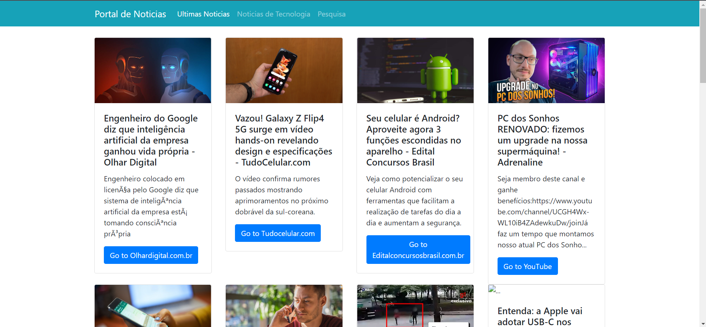

# portal-noticias

## About the project

Created this project to practice my studies about consuming API data with Javascript on front-end.

In this project **portal-noticias** you can see the top headlines news summary about the Brazil country and access the complete news through the website that published it.

## How to see the project?

You can clone or fork this project and open the `index.html` file.

**Note:** This API needs a authentication key. To get a API key you must create an account on the News API website to get your API access key.

The API key should be insert on the constant **API_KEY** (third line) at the noticias.js file who are localized through the path: ./assets/js/noticias.js

## Tech Stack

**Front-end:** `HTML`, `CSS`, `Javascript`, `Bootstrap`.

**API:** [News API](https://newsapi.org/)

## Author

- [@wendelcutrim](https://www.github.com/wendelcutrim)